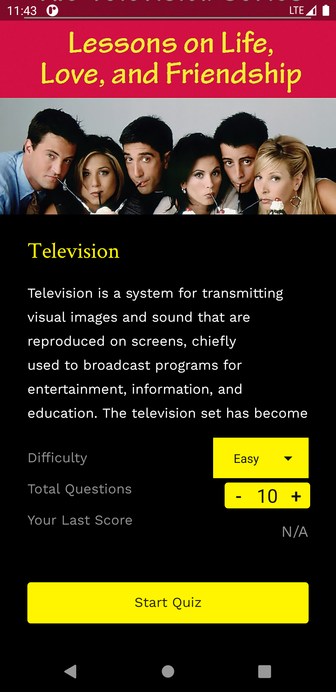
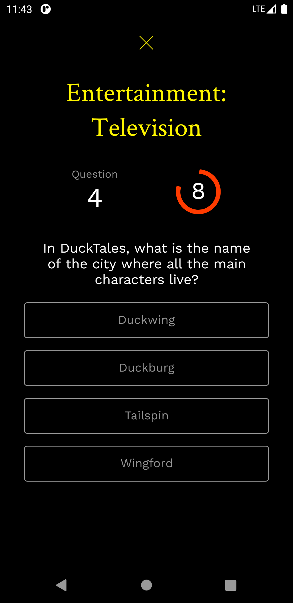

# Squezap 

  

# Download

Squezap is a minimalist quiz application where users can chose across 18 categories and also customise the number of questions and difficulty. A fun application to use when trying to pass time, test your knowledge or just trying to learn something new

#### “Anyone who stops learning is old, whether at twenty or eighty. Anyone who keeps learning stays young.” 
– Henry Ford

# Screenshoots
 

## Contributing
Looking to contribute something to Clink? [Here's how you can help](/Contributing.md).

### Todos

 - Write MORE Tests
 - Add Night Mode/ Day Mode
 - Add Leaderboard 
 - Of course and anything or idea will be welcomed!!

# License:
The MIT License (MIT)

Copyright (c) 2020 GeraudLuku

Permission is hereby granted, free of charge, to any person obtaining a copy
of this software and associated documentation files (the "Software"), to deal
in the Software without restriction, including without limitation the rights
to use, copy, modify, merge, publish, distribute, sublicense, and/or sell
copies of the Software, and to permit persons to whom the Software is
furnished to do so, subject to the following conditions:

The above copyright notice and this permission notice shall be included in all
copies or substantial portions of the Software.

THE SOFTWARE IS PROVIDED "AS IS", WITHOUT WARRANTY OF ANY KIND, EXPRESS OR
IMPLIED, INCLUDING BUT NOT LIMITED TO THE WARRANTIES OF MERCHANTABILITY,
FITNESS FOR A PARTICULAR PURPOSE AND NONINFRINGEMENT. IN NO EVENT SHALL THE
AUTHORS OR COPYRIGHT HOLDERS BE LIABLE FOR ANY CLAIM, DAMAGES OR OTHER
LIABILITY, WHETHER IN AN ACTION OF CONTRACT, TORT OR OTHERWISE, ARISING FROM,
OUT OF OR IN CONNECTION WITH THE SOFTWARE OR THE USE OR OTHER DEALINGS IN THE
SOFTWARE.
